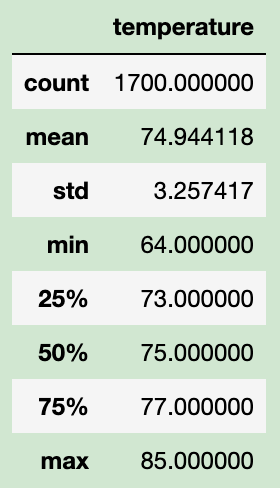
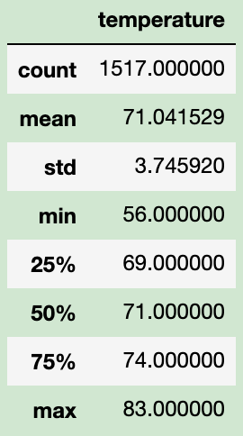
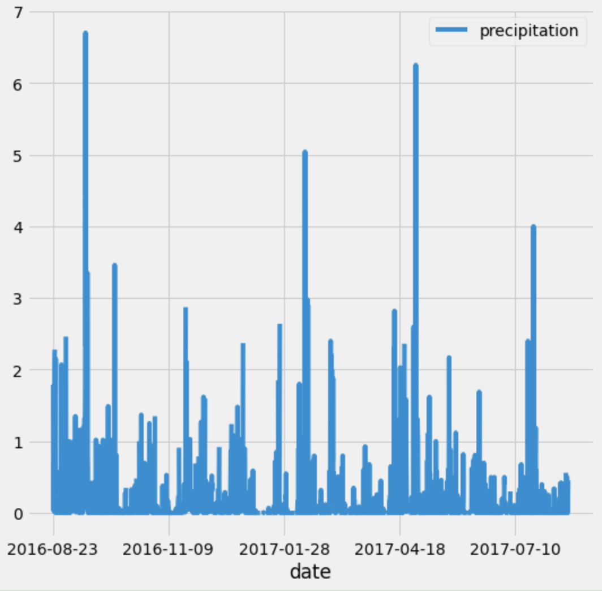
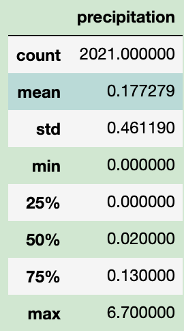

# surfs_up

## Overview of the analysis
W.avy is willing to open a surf shop in Oahu, a beautiful tourist place. This analysis determines if the shop is beneficial to locating here year-round based on temperature data for June and December in Oahu.

## Results: Provide a bulleted list with three major points from the two analysis deliverables. Use images as support where needed.

First, the most suitable temperature for surfing is between 55.4°F to 75.2°F. Oahu meets these conditions based on the June and December temperature records. It has a minimum temperature of 56°F and a maximum of 85°F.

 

Second,
June and December these two period shows a slight fluctuation. December has an average of 71°F, which may influent the ice cream sale. However, December has a more significant standard deviation than June. Therefore, it may have more variation in the December temperature. 

Third,
From the 12 months-period precipitation data (2016-2017) in Oahu, we notice that Oahu has low-level precipitation with an average of 0.17mm, and the maximum data is 6.7mm. This fact shows the weather has less effect on travellers to surf here!

## Summary
Overall, June and December's weather condition is pretty similar. The difference is December has a greater change extent temperature than June. 

We can query more factors to determine if Oahu is suitable for opening a year-round shop, such as Oahu's best location to attract visitors, the product prices on the island, rent price etc.
